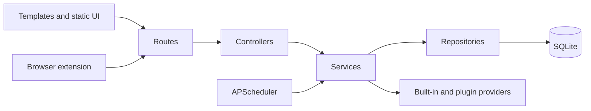

# 架构地图 / Architecture Map

## 请求链路 / Request flow

## 目录职责 / Directory responsibilities

- `outlook_web/routes/`: route registration and request boundaries.
- `outlook_web/controllers/`: HTTP validation and response contracts.
- `outlook_web/services/`: business workflows, providers, background jobs and integrations.
- `outlook_web/repositories/`: SQLite persistence and query boundaries.
- `templates/` and `static/`: Flask pages, JavaScript, CSS and translations.
- `plugins/`: plugin registry metadata; installed plugins are runtime data and are not tracked.
- `browser-extension/`: Chrome/Edge Manifest V3 extension.
- `tests/`: Python contracts, integration tests and browser-extension Jest tests.
- `scripts/`: release and maintenance checks.
- `.github/workflows/`: Python, code-quality, browser-extension, image and release automation.
- `docs/`: public architecture, feature, API, deployment and release documentation.

## 扩展边界 / Extension boundaries

临时邮箱 Provider 通过 provider base、registry、plugin manager 和 provider factory 接入。Registry 安装只接受 HTTPS 下载地址和 SHA-256；自定义 URL 需要显式环境开关。后台调度器只调用服务层，浏览器扩展仅通过公开 HTTP API 与应用交互。
