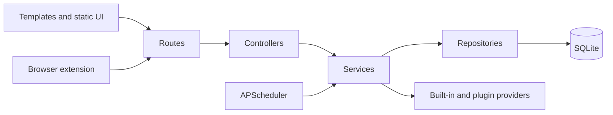

# GitHub Release v3.0.0 Implementation Plan

> **For agentic workers:** REQUIRED SUB-SKILL: Use superpowers:subagent-driven-development (recommended) or superpowers:executing-plans to implement this plan task-by-task. Steps use checkbox (`- [ ]`) syntax for tracking.

**Goal:** Publish the security hardening as v3.0.0 with a clear project map and GitHub-standard collaboration governance.

**Architecture:** README files are concise bilingual entry points. Dedicated feature and architecture maps live under `docs/`; governance lives at the repository and `.github/` roots. Existing tag-build validation remains the release-alignment authority.

**Tech Stack:** Flask/Python, JavaScript/Jest, Docker Compose, GitHub Actions, Markdown, GitHub Issue Forms.

---

### Task 1: Prepare v3.0.0 release metadata

**Files:**
- Modify: `outlook_web/__init__.py:1`
- Modify: `CHANGELOG.md:5`
- Modify: `RELEASE.md:1-120`

- [ ] Write `v3.0.0` above `Unreleased` in `CHANGELOG.md`, with `Breaking Changes`, `Security`, `Changed`, and `Testing` subsections. Include opt-in OAuth/custom URLs; HTTPS/SHA-256 and size-limited atomic plugin install; required `LOGIN_PASSWORD` and Watchtower token.
- [ ] Set `__version__ = "3.0.0"` in `outlook_web/__init__.py`.
- [ ] Update `RELEASE.md` to require breaking-change review and these commands:

```bash
python -m compileall -q outlook_web web_outlook_app.py outlook_mail_reader.py start.py tests
python -m unittest tests.test_plugin_download_boundaries tests.test_project_hardening -v
npm test
git diff --check
GITHUB_REF=refs/tags/v3.0.0 python scripts/check_release_version.py
```

- [ ] Run `GITHUB_REF=refs/tags/v3.0.0 python scripts/check_release_version.py`; expect version and changelog alignment success.
- [ ] Commit with `git commit -m "chore(release): prepare v3.0.0"`.

### Task 2: Document project functions and structure

**Files:**
- Create: `docs/FEATURES.md`
- Create: `docs/ARCHITECTURE.md`
- Modify: `README.md:1-80`
- Modify: `README.en.md:1-80`

- [ ] Create `docs/FEATURES.md` as a bilingual table: Capability, primary entry point, main modules, related tests. Cover account management, mail reading/verification, temporary mail/providers/plugins, mailbox pool, external API, notifications, OAuth, browser extension, deployment/update, and observability.
- [ ] Create `docs/ARCHITECTURE.md` describing `routes -> controllers -> services -> repositories -> SQLite`, templates/static UI, providers/plugins, scheduler, extension, tests, workflows, scripts, docs and plugins. Include:



- [ ] Add an identical bilingual `Project map / 项目导航` block after each README overview. Link `docs/FEATURES.md`, `docs/ARCHITECTURE.md`, API/deployment/plugin docs, `CONTRIBUTING.md`, `SECURITY.md`, `RELEASE.md`, and `CHANGELOG.md`; retain detailed existing content.
- [ ] Verify links with `git grep -n "docs/FEATURES.md" README.md README.en.md`; expect two matches.
- [ ] Commit with `git commit -m "docs: add project feature and architecture maps"`.

### Task 3: Add governance and GitHub collaboration files

**Files:**
- Modify: `.gitignore:45-55`
- Create: `CONTRIBUTING.md`, `SECURITY.md`, `CODE_OF_CONDUCT.md`
- Modify: `.github/PULL_REQUEST_TEMPLATE.md`
- Replace: `.github/ISSUE_TEMPLATE/bug_report.md`, `.github/ISSUE_TEMPLATE/feature_request.md`
- Create: `.github/ISSUE_TEMPLATE/config.yml`

- [ ] Remove only the ignore rules for `CONTRIBUTING.md` and `SECURITY.md`; keep internal/local AI files ignored.
- [ ] Write contribution guidance covering setup, `codex/<type>-<topic>` branches, Conventional Commits, focused tests, quality checks, PR review, and no secrets/generated files. Write security guidance with private reports to `outlookmailplus@163.com`, required impact/reproduction information, and public Issue limits. Add Contributor Covenant 2.1 as `CODE_OF_CONDUCT.md`.
- [ ] Replace the two Markdown issue templates with YAML Issue Forms. Bug fields: version, reproduction, expected/actual behavior, redacted logs, environment, secret-removal acknowledgement. Feature fields: problem, outcome, alternatives, scope, contribution interest. `config.yml` disables blank issues and links security reporting.
- [ ] Expand the existing bilingual PR template with required tests, formatting, docs, compatibility/breaking-change, security, changelog, UI screenshot and release-note checkboxes.
- [ ] Run `git check-ignore CONTRIBUTING.md SECURITY.md`; expect no output. Commit with `git commit -m "docs: add GitHub contribution governance"`.

### Task 4: Validate and publish

**Files:** all v3.0.0 release files only.

- [ ] Run:

```bash
python -m compileall -q outlook_web web_outlook_app.py outlook_mail_reader.py start.py tests
python -m unittest tests.test_temp_mail_plugin_manager tests.test_plugin_download_boundaries tests.test_project_hardening tests.test_temp_mail_plugin_api tests.test_temp_mail_plugin_e2e -v
black --check outlook_web tests web_outlook_app.py outlook_mail_reader.py start.py
isort --check-only --profile black outlook_web tests web_outlook_app.py outlook_mail_reader.py start.py
flake8 outlook_web tests web_outlook_app.py outlook_mail_reader.py start.py --count --select=E9,F63,F7,F82 --show-source --statistics
mypy --config-file pyproject.toml outlook_web/repositories/settings.py outlook_web/services/external_api.py outlook_web/controllers/system.py web_outlook_app.py
bandit -r outlook_web web_outlook_app.py outlook_mail_reader.py start.py -lll
npm test
GITHUB_REF=refs/tags/v3.0.0 python scripts/check_release_version.py
git diff --check
```

- [ ] Run `python -m unittest discover -s tests -q` and record exact results. Keep known Windows GBK, executable-bit and real-CF E2E failures separate from this release scope.
- [ ] Commit remaining release content with `git commit -m "release: v3.0.0"`; create `git tag -a v3.0.0 -m "v3.0.0"`.
- [ ] Push with `git push -u origin codex/release-v3.0.0`, fast-forward merge to `main`, then `git push origin main` and `git push origin v3.0.0`. Confirm both GitHub Release and Docker workflows before announcing.
